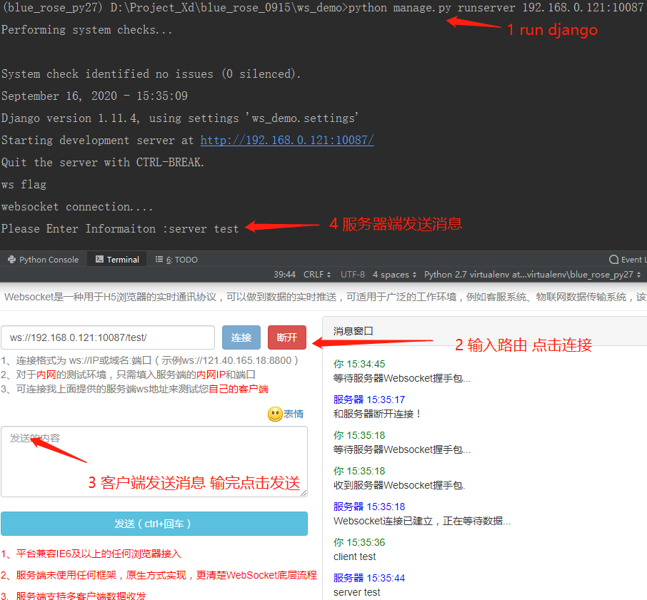

> 仅实现消息发送

webSocket是一种在单个TCP连接上进行全双工通信的协议。

webSocket使得客户端和服务器之间的数据交换变得更加简单，允许服务端主动向客户端推送数据。在WebSocket API中，浏览器和服务器只需要完成一次握手，两者之间就直接可以创建持久性的连接，并进行双向数据传输

现在，很多网站为了实现推送技术，所用的技术都是轮询。轮询是在特定的的时间间隔（如每1秒），由浏览器对服务器发出HTTP请求，然后由服务器返回最新的数据给客户端的浏览器。这种传统的模式带来很明显的缺点，即浏览器需要不断的向服务器发出请求，然而HTTP请求可能包含较长的头部，其中真正有效的数据可能只是很小的一部分，显然这样会浪费很多的带宽等资源。

基于dwebsocket库来将socket嵌入到django服务中，使其服务兼具http协议和socket协议，能够达到实时前后端通信，后端主动推送等功能。

# 什么是WebSocket

WebSocket是一种在单个TCP连接上进行全双工通信的协议

WebSocket使得客户端和服务器之间的数据交换变得更加简单，允许服务端主动向客户端推送数据。在WebSocket API中，浏览器和服务器只需要完成一次握手，两者之间就直接可以创建持久性的连接，并进行双向数据传输

现在，很多网站为了实现推送技术，所用的技术都是轮询。轮询是在特定的的时间间隔（如每1秒），由浏览器对服务器发出HTTP请求，然后由服务器返回最新的数据给客户端的浏览器。这种传统的模式带来很明显的缺点，即浏览器需要不断的向服务器发出请求，然而HTTP请求可能包含较长的头部，其中真正有效的数据可能只是很小的一部分，显然这样会浪费很多的带宽等资源。

而比较新的技术去做轮询的效果是Comet。这种技术虽然可以双向通信，但依然需要反复发出请求。而且在Comet中，普遍采用的长链接，也会消耗服务器资源。

在这种情况下，HTML5定义了WebSocket协议，能更好的节省服务器资源和带宽，并且能够更实时地进行通讯。

# 很可能用不到的判断

WebSocket 协议在2008年诞生，2011年成为国际标准，所有浏览器都已经支持了。你可以这么判断浏览器是否支持：

```html
Copy<script>
    if ('WebSocket' in window) {
        console.log('你的浏览器支持 WebSocket')
    }
</script>
```

**WebSocket for Django**

django实现websocket大致上有两种方式，一种channels，一种是dwebsocket。channels依赖于redis，twisted等，相比之下使用dwebsocket要更为方便一些。

# Install dwebsocket

```
Copypip install dwebsocket  # 最新版
# 网上貌似说最新的不好用，我们可以下载大家使用较多的老版本
pip install dwebsocket==0.4.2
```

我开始就下的默认版本，然后报错：

```
CopyAttributeError: 'WSGIRequest' object has no attribute 'is_websocket'
```

后来下载老版本就好了。

# 服务端常用方法或者属性

| 名称                               | 描述                                                         | 备注                                                  |
| ---------------------------------- | ------------------------------------------------------------ | ----------------------------------------------------- |
| @accept_websocket                  | 处理websocket和HTTP请求                                      | 该装饰器用的较多                                      |
| @require_websocket                 | 仅处理websocket请求，拒绝HTTP请求                            |                                                       |
| request.is_websocket()             | 如果请求类型是websocket，返回True，否则返回False             | 通常与@accept_websocket装饰器搭配                     |
| request.websocket                  | 当websocket请求建立后，该请求具有一个websocket属性，可以通过该属性进行通信， | 如果request.is_websocket()是False，则这个属性为None。 |
| request.websocket.wait()           | 阻塞接收消息                                                 |                                                       |
| request.websocket.read()           | 非阻塞接收消息                                               |                                                       |
| request.websocket.count_messages() | 返回队列中的消息数量                                         |                                                       |
| request.websocket.has_messages()   | 如果有新消息返回True，否则返回False                          |                                                       |
| request.websocket.send()           | 向客户端发送bytes类型的数据                                  |                                                       |
| request.websocket.close()          | 服务器端主动关闭websocket服务                                |                                                       |
| request.websocket._*iter*_()       | websocket迭代器                                              |                                                       |

# 客户端的属性和方法

| 名称           | 类型 | 描述                                |
| -------------- | ---- | ----------------------------------- |
| WebSocket      | 对象 | 提供到服务端的双向通道              |
| onopen         | 属性 | 当websocket连接时调用的事件处理程序 |
| onmessage      | 属性 | 通知接收到消息的事件处理程序        |
| onerror        | 属性 | 当出现错误时调用的事件处理程序      |
| onclose        | 属性 | 当套接字关闭时调用的事件处理程序    |
| readState      | 属性 | 报告websocket连接状态               |
| close          | 方法 | 关闭websocket                       |
| send           | 方法 | 使用websocket向服务端发送数据       |
| url            | 属性 | 报告套接字的当前URL                 |
| protocol       | 属性 | 报告服务器所选中的协议              |
| binaryType     | 属性 | 由onmessage接收的二进制数据格式     |
| bufferedAmount | 属性 | 使用send的已排队的数据字节数        |
| extensions     | 属性 | 包括服务器所选中的扩展名            |

关于`readState`，根据`readState`属性可以判断websocket的连接状态，该属性的值可以是以下几种：

| 属性值 | 对应常量   | 描述                       | 备注                 |
| ------ | ---------- | -------------------------- | -------------------- |
| 0      | CONNECTING | 正在建立连接               | 但还没有建立完毕     |
| 1      | OPEN       | 连接成功建立，可以进行通信 |                      |
| 2      | CLOSING    | 连接正在关闭               | 即将关闭             |
| 3      | CLOSED     | 连接已关闭                 | 或者根本没有建立连接 |

根据`bufferedAmount`可以知道有多少字节的数据等待发送，若websocket已经调用了close方法该属性将会一直增长。

# 必要的settings配置

```
settings.py
CopyMIDDLEWARE_CLASSES = [
    'dwebsocket.middleware.WebSocketMiddleware'
]
WEBSOCKET_ACCEPT_ALL=True  # 可以允许每一个单独的视图实用websocket
```

添加上这个中间件，就会拒绝单独的视图使用websocket，不过我们一般都是使用视图搭配websocket，所以，这个配置忘掉吧，顺便把第二个配置也忘掉，除非你要搞复杂的操作......

# 示例

**环境**

> django1.11 + Python3.6 + PyCharm2018.1 + win10

**Django中的配置**

> settings中保持默认即可

```
urls.py
Copyfrom django.conf.urls import url
from django.contrib import admin
from web import views   # web是我的APP名称

urlpatterns = [
    url(r'^admin/', admin.site.urls),
    url(r'^test/', views.test, name='test'),
]
```

`views.py`：

```python
# -*- coding: utf-8 -*-
from __future__ import unicode_literals

# from django.shortcuts import render

# Create your views here.
import json
import time


from django.shortcuts import render
from dwebsocket.decorators import accept_websocket


@accept_websocket
def test(request):

    if request.is_websocket():
        print "ws flag"
        print('websocket connection....')
        # msg = request.websocket.wait()  # 接收前端发来的消息
        # print help(request.websocket)
        # msg = request.websocket
        # print(msg, type(msg), json.loads(msg))  # b'["1","2","3"]' <class 'bytes'> ['1', '2', '3']
        i = 0
        while 1:
            msg = request.websocket.wait()  # 接收前端发来的消息
            if msg:
                # 你要返回的结果
                # for i in range(10):
                # request.websocket.send('service message: {}'.format(i).encode())  # 向客户端发送数据
                request.websocket.send(raw_input("Please Enter Informaiton :").encode())
                time.sleep(0.5)  # 每0.5秒发一次
                i += 1
            else:
                request.websocket.close()
    else:  # 如果是普通的请求返回页面
        print "http flag"
        return render(request, 'test.html')
```

`test.html`：

```html
Copy<!DOCTYPE html>
<html lang="en">
<head>
    <meta charset="UTF-8">
    <meta http-equiv="x-ua-compatible" content="IE=edge">
    <meta name="viewport" content="width=device-width, initial-scale=1">
    <title>test</title>
</head>
<body>
<div></div>

</body>
<!-- 首先引入 jQuery -->
<script src="https://cdn.bootcss.com/jquery/3.4.1/jquery.js"></script>
<script>
    // 判断浏览器是否支持WebSocket，目前应该所有的浏览器都支持了.....
    if ('WebSocket' in window) {
        console.log('你的浏览器支持 WebSocket')
    }
	// 创建一个WebSocket对象：sk，并且建立与服务端的连接（服务端程序要跑着哦）
    var sk = new WebSocket('ws://' + window.location.host + '/test/');
    // 向服务端发送消息
    sk.onopen = function () {
        console.log('websocket connection successful...');
        var l = ['1', '2', '3'];
        sk.send(JSON.stringify(l));
    };
    // 接收服务端的消息，主要的业务逻辑也在这里完成
    sk.onmessage = function (msg) {
        // 业务逻辑
        html = "<p>" + msg.data + "</p>";
        $("div").append(html);
        console.log('from service message: ', msg.data);
        // 由于服务端主动断开连接，这里也断开WebSocket连接
        if (sk.readyState == WebSocket.CLOSED) sk.close();
    };
    // 完事就关闭WebSocket连接
    sk.onclose = function (msg) {
        console.log('websocket connection close...');
        sk.close()
    };
    // 当WebSocket连接创建成功后，我们就可以向服务端发送数据了
    if (sk.readyState == WebSocket.OPEN) sk.onopen();

</script>
</html>
```

------


测试: http://www.websocket-test.com/

